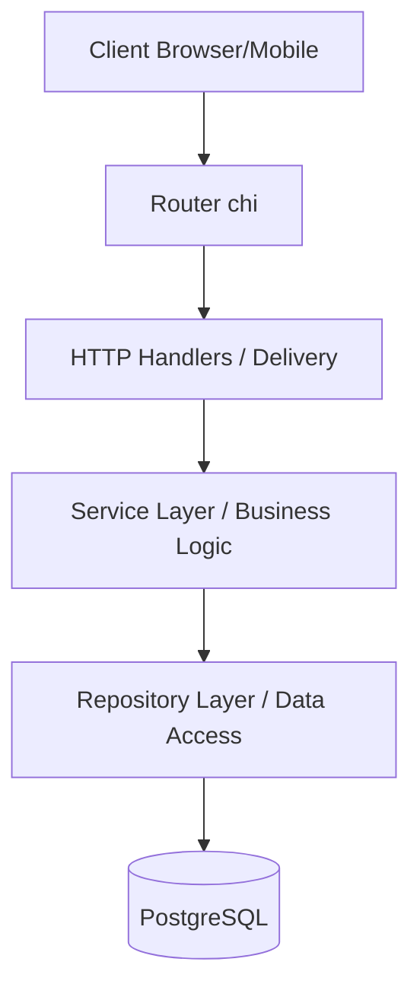

# Architecture Documentation

This document provides a comprehensive overview of the `friendy-backend` project's architecture, tech stack, and component interactions.

---

## Project Overview
**friendy-backend** is a social-oriented backend application built with **Go 1.24**. It provides a robust, layered architecture for handling user authentication, profile management, and other social features.

The project emphasizes scalability, maintainability, and clear separation of concerns using a **Layered/Clean Architecture** approach.

---

## Tech Stack
- **Core**: [Go (Golang) 1.24](https://golang.org/)
- **HTTP Framework**: [chi v5](https://github.com/go-chi/chi) (Lightweight, idiomatic router)
- **ORM**: [GORM v1.31.1](https://gorm.io/) (PostgreSQL dialect)
- **Database**: [PostgreSQL](https://www.postgresql.org/)
- **Configuration**: [Viper v1.21.0](https://github.com/spf13/viper) (Support for `.env`, YAML, and ENV variables)
- **Authentication**:
  - [JWT-Go v5](https://github.com/golang-jwt/jwt) (Access & Refresh Tokens)
  - `golang.org/x/crypto` (Argon2/Bcrypt for password hashing)
- **Migrations**: [golang-migrate v4](https://github.com/golang-migrate/migrate)
- **Development**:
  - [Air](https://github.com/cosmtrek/air) (Live reloading)
  - Docker & Docker Compose (Containerized infrastructure)

---

## Architectural Pattern: Layered Architecture
The application is organized into several layers to ensure that business logic remains independent of external delivery mechanisms (HTTP, CLI) and data persistence details (PostgreSQL, GORM).

### High-Level Component Diagram


---

## Directory Structure

```text
.
├── cmd/                # Entry points
│   └── api/v1/         # Main application (v1) main.go
├── internal/           # Private application code
│   ├── api/            # API specific logic
│   ├── app/            # Application Container & Router
│   ├── config/         # Configuration loading & DB connection
│   ├── database/       # DB Models & Migration logic
│   ├── delivery/       # HTTP Handlers (Controllers)
│   ├── repository/     # Data Stores (Repositories)
│   ├── service/        # Business Logic (Services)
│   └── utils/          # Shared Helpers (Token, Password)
├── migrations/         # SQL Migration files (Up/Down)
├── Makefile            # Automation for DB tasks & migrations
└── docker-compose.yml  # Local infrastructure definitions
```

---

## Core Components

### 1. Delivery Layer (`internal/delivery/http`)
- Responsible for parsing HTTP requests, validating input, and returning JSON responses.
- Handlers are domain-specific (e.g., `auth.Handler`).
- Does NOT contain business logic; instead, it delegates to the Service Layer.

### 2. Service Layer (`internal/service`)
- Contains the "heart" of the application: core business rules and logic.
- Orchestrates multiple repositories if needed.
- Is unaware of HTTP details (e.g., uses `context.Context` but not `http.ResponseWriter`).

### 3. Repository Layer (`internal/repository`)
- Abstracts database operations using GORM.
- Provides a clean interface (`store.UserStore`) to the service layer.
- Handles CRUD operations and complex queries on entities.

### 4. Database Models (`internal/database/models`)
- Defines the structure of the data entities:
  - **User**: Core user account information.
  - **UserProfile**: Extended user details (bio, avatar).
  - **RefreshToken**: Persistence for JWT refresh token rotation.
  - **City/Country**: Geo-spatial reference data.

---

## Request Lifecycle
1. **Request Received**: An HTTP request hits the `chi` router in `internal/app/router.go`.
2. **Global Middleware**: Request passes through logging, recovery, and Real-IP middleware.
3. **Route Matching**: The router matches the URL to a specific **Handler** method (e.g., `auth.Handler.Login`).
4. **Service Invocation**: The handler calls a method in the **Service Layer** (e.g., `auth.Service.Login`).
5. **Data Retrieval**: The service uses one or more **Repositories** to interact with the database.
6. **Business Logic**: The service applies rules (e.g., validating password hash).
7. **Response Transformation**: The service returns data/error to the handler.
8. **JSON Response**: The handler transforms the result into a standardized JSON response.

---

## Configuration & Infrastructure
- **Environment Management**: Uses Viper to load configuration from `config.development.yaml` or environment variables (prefixed with `APP_`).
- **Local Dev**: Run `docker-compose up` to start PostgreSQL, then `air` to start the live-reloading Go server.

---

## Adding a New Feature: Step-by-Step

Follow these steps to implement a new feature (e.g., `posts`, `comments`, `notifications`):

### 1. Database Migration
Create new migration files using the Makefile:
```bash
make create name=create_posts_table
```
Edit the generated `.up.sql` and `.down.sql` files in the `migrations/` directory, then apply them:
```bash
make up
```

### 2. Define the Model
Add the GORM model for the new entity in `internal/database/models/`:
- Create `internal/database/models/post.go`.

### 3. Implement the Repository
Define the data access interface and its GORM implementation in `internal/repository/store/`:
- Create `internal/repository/store/post_store.go`.
- Define `PostRepository` interface and `PostStore` struct.

### 4. Implement the Service
Add the business logic in `internal/service/`:
- Create a new directory `internal/service/post/`.
- Create `internal/service/post/post_service.go` containing the `Service` struct and its methods.

### 5. Implement the Delivery Layer (Handlers & Routes)
Create the HTTP handlers and route registration in `internal/delivery/http/`:
- Create a new directory `internal/delivery/http/post/`.
- Create `internal/delivery/http/post/handler.go` for the HTTP handlers.
- Create `internal/delivery/http/post/routes.go` to define the routes.

### 6. Wire Everything Together
Finally, connect the new components in the application container:

1.  **Update Handlers Struct**: Add the new handler to the `Handlers` struct in [internal/app/handlers.go](file:///home/mc-solo/Code/friendy-backend/internal/app/handlers.go).
2.  **Initialize Components**: In the `New` function in [internal/app/app.go](file:///home/mc-solo/Code/friendy-backend/internal/app/app.go):
    - Initialize the Store: `postStore := store.NewPostStore(db)`
    - Initialize the Service: `postSvc := post.NewService(postStore)`
    - Initialize the Handler: `postHandler := post.NewHandler(postSvc)`
    - Assign to Handlers: `handlers.Post = postHandler`
3.  **Register Routes**: In the `NewRouter` function in [internal/app/router.go](file:///home/mc-solo/Code/friendy-backend/internal/app/router.go), register the new routes:
    ```go
    api.Route("/posts", func(postRouter chi.Router) {
        post.RegisterRoutes(postRouter, h.Post)
    })
    ```
